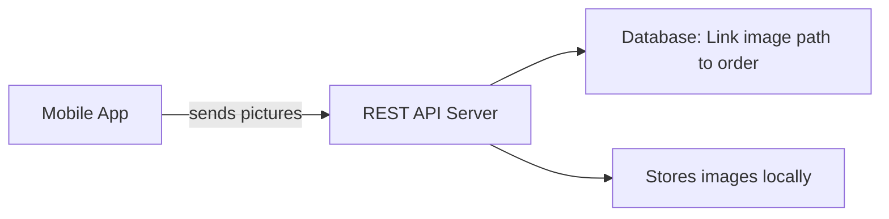

# InterDataSoft API REST Server

Seamlessly connect your manufacturing workflow with *InterDataSoft MRP Systems* check us out at [InterDataSoft](https://interdatasoft.com/)!

This REST API Server is used as support for MobileWerk: a mobile app that allows taking pictures and associationg them to different orders. 

---

## Key Features

- Secure Storage

&nbsp; All photos are stored in pre-configured server locations with consistent naming and directory structures.

- Database \& MRP Integration

&nbsp; Automatic linkage of each photo to your SQL database records and MRP system operations.

- Collaboration \& Visibility

&nbsp; Enhance communication between teams by providing instant access to related documentation.

---

## API Overview

The API provides endpoints for:

- Authentication – Secure login and token-based access  # Will be included in a future release

- Photo Upload – Attach and classify images by workflow type  

- Metadata Management – Store and query image attributes  

- Database Sync – Ensure all photos are tied to the correct MRP entries  

- *Search \& Retrieval – Query and download photos by order or other criteria  

The previse structure will be shared once the apps are publicly release on the play and apple store

---

## Installation and Configuration

1. **Head over to the Releases tab** (on the right) and use the provided installer to install the application.  
   The application will automatically run as a **Windows Service** named `WerkMobileAPIServer`.  
   Logs can be found in the **Windows Event Viewer**.

2. **Modify the appsettings** to link the application to your table or database.  
   - The table **must be named** `TrackDoc_Mstr`.  
   - Use the provided **SQL program** to create it.  
   - *(The ability to change this may be added in a future version.)*

---

## Defining Tables

- In the **Tables** folder, you’ll find an example showing how to describe the tables that the server should interact with.  
- You can include multiple `.json` files — each one is treated as a separate category.

---

## How It Works

The server saves the picture itself locally (will be added the possibility to specify the location, currently it saves it under C/MobileWerk) and saves the path (along with any relevant information from the other tables specified in the `.json` files) into `TrackDoc_Mstr`.  

