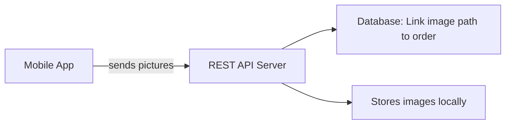

# InterDataSoft API REST Server

Seamlessly connect your manufacturing workflow with *InterDataSoft MRP Systems* check us out at [InterDataSoft](https://interdatasoft.com/)!

This REST API Server is used as support for MobileWerk: a mobile app that allows taking pictures and associationg them to different orders. 

```mermaid
flowchart LR
    A[Mobile App] -- sends pictures --> B[REST API Server]
    B --> C[Database: Link image path to order]
    B --> D[Stores images locally]
```

---

## Key Features

- Secure Storage

&nbsp; All photos are stored in pre-configured server locations with consistent naming and directory structures.

- Database \& MRP Integration

&nbsp; Automatic linkage of each photo to your SQL database records and MRP system operations.

- Collaboration \& Visibility

&nbsp; Enhance communication between teams by providing instant access to related documentation.

---

## API Overview

### **GET Requests**
- **`/test`** — Test the connection to the server  
- **`/categories`** — Get the different categories of orders  
- **`/drives`** — Get the different save locations  
- **`/drives/current`** — Get the current drive the server is set to  
- **`/search`** — Search for an order within a category  
- **`/images/{imageId}`** — Get the image associated with an ID  
- **`/images/ids/{docCode}`** — Get the list of image IDs associated with an order  
- **`/images/remarks/{docCode}`** — Get the comments associated with that order  

---

### **POST Requests**
- **`/drives`** — Choose which location the server saves the image to  
- **`/path`** — Create new save locations for the server (drives)  
- **`/image`** — Save an image on the server and update the database  

---

### **PUT Requests**
- **`/images/remarks/{docCode}`** — Save the comments to an order  

---

### **DELETE Requests**
- **`/images/{imageId}`** — Remove an image from the database (deletes locally and on the DB)

---

## Installation and Configuration

1. **Head over to the Releases tab** (on the right) and use the provided installer to install the application.  
   The application will automatically run as a **Windows Service** named `WerkMobileAPIServer`.  
   Logs can be found in the **Windows Event Viewer**.

2. **Modify the appsettings** to link the application to your table or database.  
   - The table **must be named** `TrackDoc_Mstr`.  
   - Use the provided **SQL program** to create it.  
   - *(The ability to change this may be added in a future version.)*

---

## Defining Tables

- In the **Tables** folder, you’ll find an example showing how to describe the tables that the server should interact with.  
- You can include multiple `.json` files — each one is treated as a separate category.

---

## How It Works

The server saves the picture itself locally (will be added the possibility to specify the location, currently it saves it under C/MobileWerk) and saves the path (along with any relevant information from the other tables specified in the `.json` files) into `TrackDoc_Mstr`.  

